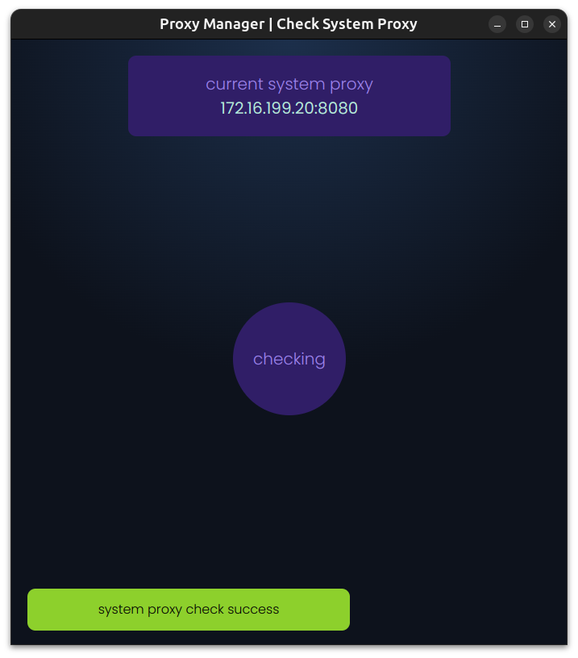

<!-- 
 -->

  

# **_Package Manager_**

A Proxy Manager build with **Electronjs** for Window, Linux, Mac

 

 

## Features:

- Lightweight and fast proxy manager built using [ElectronJS](https://www.electronjs.org/) framework.
- Easy to create,edit, delete and apply proxies
- You can create custom proxy
- Custom proxies are stored in **localstorage**
- In the main page you will get multiple cards, click on the card whose proxy you want to apply
- Add, Remove or Edit the existing proxy list
- Automatic Theme support based on your system settings

## Proxy considered

- System (Windows, Linux, Mac)
- Git
- NPM
- VS code
- Pip
- System (user) Enviroments

## Tech Stack

    
    
    
    

> Go to [release section](https://github.com/dev-AshishRanjan/proxy-manager/releases) to get Proxy Manager for your PC
>
> OR,
>
> Download through our [Website](https://proxy-manager-pc.vercel.app) with ease.

## Images

| Home Window                                                         | Add Custom Proxy                                                              |
| ------------------------------------------------------------------- | ----------------------------------------------------------------------------- |
|   |   |

| Notice                              | Check System Proxy                      | Add Sudo(for Linux)              |
| ----------------------------------- | --------------------------------------- | -------------------------------- |
|  |  |  |

## Installation

1. Go to [release section](https://github.com/dev-AshishRanjan/proxy-manager/releases) or Download through our [Website](https://proxy-manager-pc.vercel.app) with ease.
2. Download the package format supported by your operating system

- window : Proxy-Manager-1.0.7-Setup.exe
- linux : proxy-manager_1.0.7_amd64.deb
- mac : Proxy-Manager-darwin-x64-1.0.7.zip

3. After download, install the package
   > Remember during installation you will get warning
   >
   > > "Unverified Publisher" : This is due to lack code signing(paid), which I don't have
   >
   > Ignore this warning

- step to ignore warning on window:
  - click on **More info**
    - 
  - click on **Run Anyway**
    - 

4. After ignoring the warning, you can run Proxy Manager
